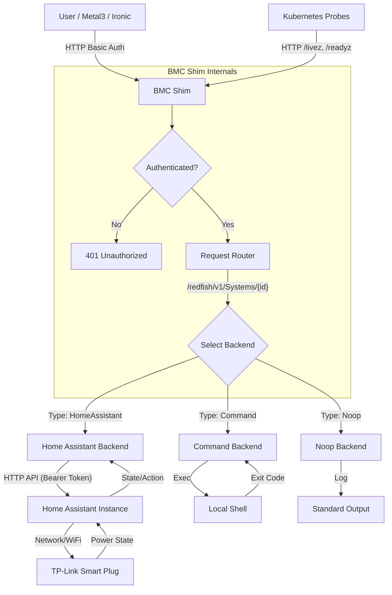

# bmc-shim

- [bmc-shim](#bmc-shim)
  - [Overview](#overview)
  - [Flow Chart](#flow-chart)
  - [Build](#build)
  - [Run](#run)
    - [Quick Start (using make)](#quick-start-using-make)
    - [Quick Start (using go run)](#quick-start-using-go-run)
    - [Home Assistant backend (single system)](#home-assistant-backend-single-system)
    - [Multi-system Home Assistant example](#multi-system-home-assistant-example)
    - [Environment file example (credentials.env)](#environment-file-example-credentialsenv)
  - [Test with curl](#test-with-curl)
  - [Using with BareMetalHost (Metal3)](#using-with-baremetalhost-metal3)
  - [Deployment](#deployment)

## Overview

A tiny Go Redfish-compatible shim to control power on/off using pluggable backends. Useful for pointing Metal3/Ironic BMC addresses at a custom controller.

This assumes the Node has an OS provisioned onto it, this currently does not support provisioning and deprovisioning the underlying operating system.
For my use case, this is acceptable, as the node automatically rejoins to the cluster on boot.

- Provides minimal Redfish endpoints:
  - `GET /redfish/v1/`
  - `GET /redfish/v1/Systems`
  - `GET /redfish/v1/Systems/{id}`
  - `POST /redfish/v1/Systems/{id}/Actions/ComputerSystem.Reset` with `{ "ResetType": "On" | "ForceOff" | "GracefulShutdown" | "ForceRestart" }`
- Health checks:
  - `GET /livez` (liveness)
  - `GET /readyz` (readiness - checks backend connectivity)
- Basic auth (username/password) supported.
- Backends:
  - `noop`: Logs operations only.
  - `command`: Runs shell commands for on/off.
  - `homeassistant`: Controls an HA `switch` entity. Syncs power state and name from HA.

## Flow Chart



## Build

Using Make:

```sh
make build
# Output binary at /tmp/bmc-shim
```

Using Go directly:

```sh
cd tools/bmc-shim
GO111MODULE=on go build -o bmc-shim ./cmd/bmc-shim
```

Building container image with [ko](https://github.com/ko-build/ko):

```sh
make ko-build
```

## Run

### Quick Start (using make)

```sh
make run
```

### Quick Start (using go run)

First, copy your credentials to `credentials.env` (see below for required variables).

Run the shim with Home Assistant backend and multi-system mapping:

```sh
set -a && source ./credentials.env && set +a && \
go run ./cmd/bmc-shim/main.go \
  --listen :8000 \
  --user admin \
  --pass secret \
  --backend homeassistant \
  --ha-url "$BMC_SHIM_HA_URL" \
  --ha-token "$BMC_SHIM_HA_TOKEN" \
  --systems "1=switch.power_strip_zone_1_kvm_1,2=switch.power_strip_zone_2_kvm_2,3=switch.power_strip_zone_3_kvm_3,4=switch.power_strip_zone_1_kvm_4,5=switch.power_strip_zone_2_kvm_5,6=switch.power_strip_zone_3_kvm_6"
```

Or, for a single system with the command backend:

```sh
go run ./cmd/bmc-shim/main.go \
  --listen :8000 \
  --user admin \
  --pass secret \
  --system-id 1 \
  --backend command \
  --on-cmd 'echo powering on; # add real action' \
  --off-cmd 'echo powering off; # add real action'
```

### Home Assistant backend (single system)

```sh
export BMC_SHIM_HA_URL="https://home.example.com"
export BMC_SHIM_HA_TOKEN="<your_long_lived_token>"
export BMC_SHIM_HA_ENTITY="switch.your_entity"

go run ./cmd/bmc-shim/main.go \
  --listen :8000 \
  --user admin \
  --pass secret \
  --system-id 1 \
  --backend homeassistant \
  --ha-url "$BMC_SHIM_HA_URL" \
  --ha-entity "$BMC_SHIM_HA_ENTITY" \
  --ha-token "$BMC_SHIM_HA_TOKEN"
```

### Multi-system Home Assistant example

```sh
export BMC_SHIM_HA_URL="https://home.arthurvardevanyan.com"
export BMC_SHIM_HA_TOKEN="<token>"

go run ./cmd/bmc-shim/main.go \
  --listen :8000 \
  --user admin \
  --pass secret \
  --backend homeassistant \
  --ha-url "$BMC_SHIM_HA_URL" \
  --ha-token "$BMC_SHIM_HA_TOKEN" \
  --systems "1=switch.power_strip_zone_1_kvm_1,2=switch.power_strip_zone_2_kvm_2,3=switch.power_strip_zone_3_kvm_3,4=switch.power_strip_zone_1_kvm_4,5=switch.power_strip_zone_2_kvm_5,6=switch.power_strip_zone_3_kvm_6"
```

### Environment file example (credentials.env)

```sh
export BMC_SHIM_HA_URL="https://home.arthurvardevanyan.com"
export BMC_SHIM_HA_TOKEN="<token>"
```

Query states via Redfish for a couple of systems:

```sh
curl -u admin:secret http://127.0.0.1:8000/redfish/v1/Systems
curl -u admin:secret http://127.0.0.1:8000/redfish/v1/Systems/1
curl -u admin:secret http://127.0.0.1:8000/redfish/v1/Systems/6
```

Query current state directly from Home Assistant:

```sh
curl -H "Authorization: Bearer $BMC_SHIM_HA_TOKEN" \
     -H 'Accept: application/json' \
     "$BMC_SHIM_HA_URL/api/states/$BMC_SHIM_HA_ENTITY"
```

Query state via the shim (reports `PowerState`):

```sh
curl -u admin:secret http://127.0.0.1:8000/redfish/v1/Systems/1
```

Environment variables `BMC_SHIM_USER` and `BMC_SHIM_PASS` can substitute `--user/--pass`.

## Test with curl

```sh
curl -u admin:secret http://127.0.0.1:8000/redfish/v1/
curl -u admin:secret http://127.0.0.1:8000/redfish/v1/Systems
curl -u admin:secret http://127.0.0.1:8000/redfish/v1/Systems/1
curl -u admin:secret -X POST \
  -H 'Content-Type: application/json' \
  -d '{"ResetType":"On"}' \
  http://127.0.0.1:8080/redfish/v1/Systems/6/Actions/ComputerSystem.Reset
```

## Using with BareMetalHost (Metal3)

Point your `BareMetalHost.spec.bmc.address` at the shim, using a Redfish URL, for example:

```text
redfish+http://<shim-host>:8000/redfish/v1/Systems/1
```

Set `credentialsName` to a Secret containing `username` and `password` that match the shim's `--user/--pass`.

Note: This shim only implements power control. Inventory, boot device control, and virtual media are not implemented.

## Deployment

See [deploy/Readme.md](deploy/Readme.md) for Kubernetes deployment examples.
